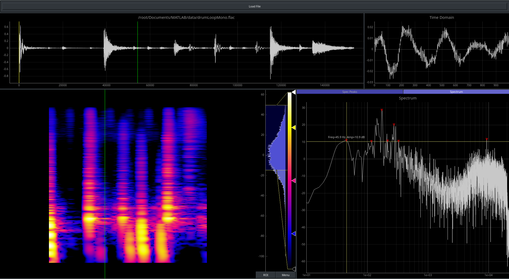

# YAAA

## About
YAAA (Yet Another Audio Analyzer) is a simple program written in python. It is still under development.


The idea is having a very simple powerful program to look at an audio singnal's time and frequency domain data interactively.


Using pyo, yaaa is able to play back sound, but also provides a granular sampling engine, so one can scrub through the sound. Pyqtgraph provides a very powerful interface that supports rapid updates.

A peak finding algorithm (written by Marcos Duarte) is used to extract and display spectral peaks. These frequnecies and amplitudes can be examined in a table view and can be exported. (For example to create modal models in faust or Max/MSP or similar.)

## Usage
This is still in a very early stage of development, and has just been tested under linux. Since it is based on python, it should work under other platforms too.
Loading long soundfiles might take a while.


### Dependencies
- python 3.6
- pyqtgraph
- pyo
- numpy
- scipy
- librosa
- tkinter

The peak finding algorithm used here was created by Marcos Duarte, https://github.com/demotu/BMC.

These dependencies are probably best installed via conda (https://conda.io/docs/user-guide/install/download.html)

### Installation via conda
- [optional] Create a new envirmonment: ```conda create -n yaaa python=3.6```
- ```conda install pyqtgraph```
- ```conda install scipy```
- ```conda install -c conda-forge librosa```
- follow instructions here: 
    http://ajaxsoundstudio.com/pyodoc/download.html
    But if you are on linux, compile from sources with instructions here:
    http://ajaxsoundstudio.com/pyodoc/compiling.html
- installatioon of tkinter is probably best done via ```apt-get install python-tk``` on debian based linux systems.

That should be it. After that, you should be able to
(activate your new environment via ```source activate yaaa``` in case you created one)
and start the yaaa executeable. 

Yaaa has a simple command line interface as shown below. But it can also simply be started and a new file can be loaded via the GUI. 
```
usage: yaaa [-h] [-f F] [-c C] [-o O]

Yet Another Audio Analyzer.

optional arguments:
  -h, --help  show this help message and exit
  -f F        file to open
  -c C        provide a number of seconds to extract from the file
  -o O        provide a number of seconds as an offset from the beginning.
```


## Future ideas
- Adjustment of peak finding algorithm via GUI
- decay rate computation of spectral peaks

## Known Issues
- Can get pretty slow for large files. This tool is thought for analysis of impulse responses or other small portions of audio. probably automatic cropping will be introduced.
- Installation should get easier
- There is probably a bug for out of bound indizes when cropping or offestting via the CLI. Simple sanity checks need to be introduced.